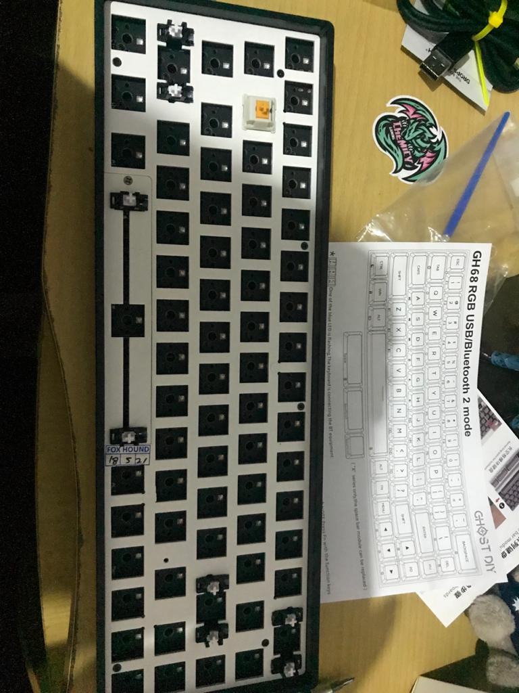
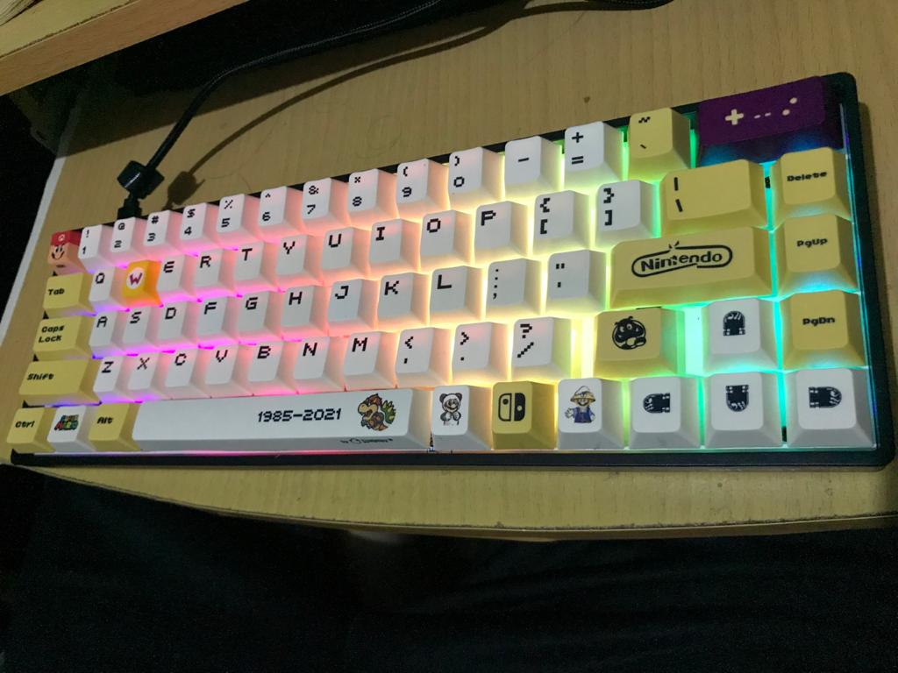

Hi, reader. Hoping that you are all healthy. And for this time I want you to know that I do feel like don't want to write this note again, lol.
It's become nonsense lately for me to write this note because in the last 3 weeks I'm being inconsistent with what I want to accomplish.

But finally, I'm getting obsessed with a mechanical keyboard, and at least for me is kind of refresh from my severe loneliness. It's my cure or some kind of remedy though for to be not getting depressed more often in this pandemic situations so that I've another reason to achieving my ulitmate hobbyist of crafting hardware, especially PC stuff.

And then, I Build this mechanical keyboard from DIY GHOST to fill my spare time besides doing my primary job as an OPS, and for that, I think I'll be able more enjoying life and don't get too much attention about the news of the coronavires pandemic. After all, here is below what I've been built from just an empty framework keyboard to become my first DIY mechanical keyboard.

Lastly, for closing this note I want you to keep hygiene, stay healthy, stay safe and if you're not so urgent to be outside then it's better to stay at your home.
And thank you for reading my note in the third week of Aug 2021.

By the way, Happy Independence day for INDONESIA. "My Lovely Nations"
Merdeka!!

ps:
*pardon me if there is any nonsense sentences that makes you need twice to understand.
*please kindly comment if any necessary sentence that you've seen wrong.