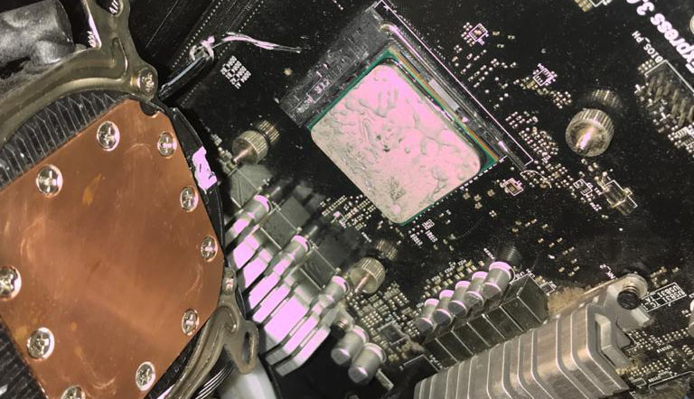

Hey-ho, Here goes a note for the end of my first week of July 2021. So far, besides I’m learning some other programming languages. There is another small distraction about what I’m doing till this week and It is my hardware hobby. As you may know, When I get to electronic craft lessons in junior high school I become so overwhelmed person. Yea, Instead do a deep learn about physics lesson I just care about my basic math problem, tho. Fun fact that I don’t take so seriously about electronic craft in my junior high school until I got into senior high school I’ve got my new personal computer with my own design architect inside of it. That was probably Athlon and Intel's first-generation Core series I presume in the middle of 2006 to 2010. So I end up choosing AMD Athlon II as my rig till 2013. And then as AMD has released a new AMD FX series with codename Vishera in 2011 (I assume. CMIIW) I upgraded my rigs to adapt with the new FX series. After that, 5 years later as a hobbyist and hardware pc enthusiast once again I do update the rigs to get used by the new Ryzen series in 2018.So far the new processer was incredibly fast and it is can't deny that AMD has been improving their own CPU temperature performance. Even that I use it almost 72 hours straight in 2 days and It seems normally okay. 

Here is below my latest CPU before get clean up with some new thermal paste. 

My thought on my latest rigs was good but it will be great if I add with a Ultra M.2 solid state drive Gen3 and an internal SSD in the next upgrade future.
So the boot up to OS will be fast enough and the CPU performance will be optimized too. 

By the way now the blog will be have new navigation menu. I'll be put my latest work about FE and other project in my Portfolio page. Hope will release asap, tho.
Stay tune.
And thanks for read my blog. GBU.
